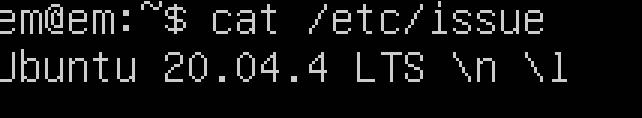

## Part 1. Установка ОС

Ubuntu version:


---

## Part 2. Создание пользователя

* Creation of a new user:


* cat /etc/passwd:


## Part 3. Настройка сети ОС

* Для изменения имени машины редактируем файл, находящийся по этому пути: 
```
/etc/hostname
```


* Меняем часовой пояс через команду ```timedatectl```


* Команда ```ip link show``` поможет вывести названия всех сетевых интерфейсов


_lo (loopback device) – виртуальный интерфейс, присутствующий по умолчанию в любом Linux. Он используется для отладки сетевых программ и запуска серверных приложений на локальной машине. С этим интерфейсом всегда связан адрес 127.0.0.1. У него есть dns-имя – localhost. Посмотреть привязку можно в файле /etc/hosts._


* IP-адрес, получаемый от DHCP:


__DHCP__  _(англ. Dynamic Host Configuration Protocol — протокол динамической настройки узла) — прикладной протокол, позволяющий сетевым устройствам автоматически получать IP-адрес и другие параметры, необходимые для работы в сети TCP/IP._

* Внутренний IP-адрес шлюза, он же IP-адрес по умолчанию:


* Внешний IP-адрес:
  


* Статический IP-адрес и DNS назначаем через config-файл ```netplan```


* Пингуется __"ВО"__!

